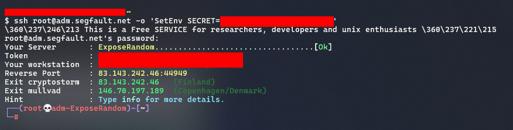

# Expose local HTTP Proxies over Cloudflare Tunnel

### Prerequisites

* Server
  * For running your proxy.
* Client:
  * For accessing your proxy.
* Access to Cloudflare Zero Trust:
  * For exposing your proxy to Internet over Cloudflare Infrastructure
    * PS: _You will need an domain pointing to Cloudflare's nameservers._


### Exit node

You will need run the local proxy on your server.&#x20;

For this POC, i will be using a segfault.net instance as exit node:

<figure><figcaption></figcaption></figure>


### Cloudflare and Server Setup

On Cloudflare Dashboard, just go to the Zero Trust:

<figure><figcaption></figcaption></figure>


Then, Create a tunnel:

<figure><figcaption></figcaption></figure>


Select Cloudflared:

<figure><figcaption></figcaption></figure>


Is required to name your tunnel:

<figure><figcaption></figcaption></figure>


Copy the tunnel's secret (you can install it, i prefer to always keep the things up on my terminal session only):

<figure><figcaption></figcaption></figure>


Paste and run it on your server:

<figure><figcaption></figcaption></figure>


After that, you will see a new connector on Cloudflare Dashboard. Just go ahead with "Next" button:

<figure><figcaption></figcaption></figure>


Then, chose your domain and type your desidered subdomain:

<figure><figcaption></figcaption></figure>


Now, back to your server, start your proxy :

<figure><figcaption></figcaption></figure>


Back to Cloudflare Dashboard, fill with your proxy listener configuration:

<figure><figcaption></figcaption></figure>


Then, click on Complete setup.


### Client Setup

On your client, download the Cloudflared binary and run Cloudflare Tunnel Access:

```
cloudflared access tcp --hostname <subdomain>.<domain> --url <proxy-local-forward>
```

<figure><figcaption></figcaption></figure>


Now, we can check the proxy by `curl` command with `--proxy` parameter:

<figure><figcaption></figcaption></figure>


We can use the proxy on browser too:

<figure><figcaption></figcaption></figure>


This instance on segfault.net has 2 exit nodes, as we see on the [#exit-node](./#exit-node "mention"):

<figure><figcaption></figcaption></figure>


Well, this is an simple example. You can use this to multiple scenarios. I have some personal notes that i like to share with you:

* If you are in an controlled environment (your corp, eg.), the network administrator will see that you connected to an Cloudflare's IP, not the exit node&#x20;
